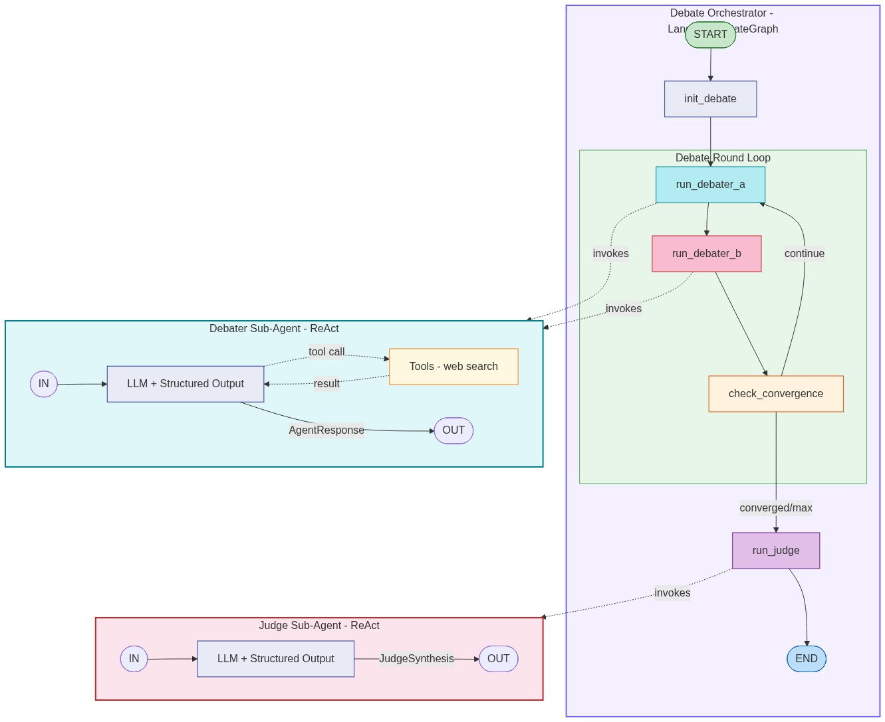

# Duelyst.ai Core

**Open-source AI debate engine** — multi-model adversarial debates with LangGraph orchestration.

Two AI models argue, challenge each other, and converge toward a synthesis. The result is higher-quality analysis than any single model produces alone.

[](LICENSE)
[](https://www.python.org/downloads/)
[](https://pypi.org/project/duelyst-ai-core/)

---

## Why

Large language models have two well-known failure modes:

- **Sycophancy** — a single model tends to agree with the user rather than push back
- **Hallucination** — fabricated facts go unchallenged when there's no adversary

When two models debate adversarially, they challenge claims, request evidence, and surface disagreements. The result is more rigorous, balanced analysis.

## Install

```bash
pip install duelyst-ai-core
```

To enable Tavily-backed web search via `--tools search`, install the optional
search dependencies too:

```bash
pip install "duelyst-ai-core[search]"
```

That extra installs the modern `langchain-tavily` integration used by LangChain 1.x.

Set API keys for the models you want to use. For CLI usage, you can either export
them in your shell or put them in a local `.env` file. The CLI now auto-loads `.env`
from the current working directory.

```bash
# Option 1: local .env file used by the CLI
cp .env.example .env

# Fill values as plain KEY=value lines. Quotes are optional for API keys.
ANTHROPIC_API_KEY=your-key-here
OPENAI_API_KEY=your-key-here
GOOGLE_API_KEY=your-key-here       # optional
TAVILY_API_KEY=your-key-here       # optional, for web search

# Option 2: export into the shell
export ANTHROPIC_API_KEY=your-key-here
export OPENAI_API_KEY=your-key-here
export GOOGLE_API_KEY=your-key-here       # optional
export TAVILY_API_KEY=your-key-here       # optional, for web search
```

## Quick Start

### CLI

```bash
# Basic debate — low-cost defaults (Claude Haiku + GPT mini)
duelyst debate "Should startups use microservices or monoliths?"

# Choose models
duelyst debate "Rust vs Go for backend" --model-a claude-sonnet --model-b gpt-5

# Custom instructions
duelyst debate "Will AI replace software engineers by 2030?" \
  --model-a claude-haiku \
  --model-b gemini-flash \
  --instructions-a "Defend the position that AI will replace most jobs" \
  --instructions-b "Defend the position that AI will augment, not replace" \
  --rounds 5

# Enable web search for real-time evidence
duelyst debate "Bitcoin price prediction 2026" \
  --model-a claude-haiku --model-b gpt-mini --tools search

# From source, include the optional search dependencies in your environment first
uv sync --group dev --extra search

# Output formats
duelyst debate "..." --output markdown > debate.md
duelyst debate "..." --output json > debate.json
```

### Python API

```python
import asyncio
from duelyst_ai_core import DebateConfig, DebateOrchestrator, ModelConfig

config = DebateConfig(
    topic="Should startups use microservices or monoliths?",
    model_a=ModelConfig(provider="anthropic", model_id="claude-haiku-4-5"),
    model_b=ModelConfig(provider="openai", model_id="gpt-5.4-mini"),
    max_rounds=5,
)

orchestrator = DebateOrchestrator(config)

result = asyncio.run(orchestrator.graph.ainvoke({
    "config": config,
    "turns": [],
    "current_round": 0,
    "current_agent": "a",
    "convergence_history": [],
    "status": "running",
    "synthesis": None,
    "error": None,
}))

# result["synthesis"] contains the judge's balanced analysis
# result["turns"] contains the full debate transcript
```

### Streaming Events

Stream real-time events as the debate progresses using `arun_with_events()`:

```python
import asyncio
from duelyst_ai_core import DebateConfig, DebateOrchestrator, ModelConfig

config = DebateConfig(
    topic="Will AI replace software engineers by 2030?",
    model_a=ModelConfig(provider="anthropic", model_id="claude-haiku-4-5"),
    model_b=ModelConfig(provider="openai", model_id="gpt-5.4-mini"),
)

async def main():
    orchestrator = DebateOrchestrator(config)
    async for event in orchestrator.arun_with_events():
        print(f"{event.event}: {event}")

asyncio.run(main())
```

Events emitted: `debate_started`, `round_started`, `turn_started`, `turn_completed`,
`convergence_update`, `synthesis_started`, `synthesis_completed`, `debate_completed`.

For custom consumers (e.g., SSE relay), implement the `DebateEventCallback` protocol:

```python
from duelyst_ai_core import DebateEventCallback, DebateOrchestrator

class MyCallback:
    async def on_event(self, event):
        # SSE, WebSocket, logging, etc.
        print(event.model_dump_json())

orchestrator = DebateOrchestrator(config, callback=MyCallback())
```

See [`examples/`](examples/) for more complete examples.

## Supported Models

| Alias | Provider | Model |
|-------|----------|-------|
| `claude-haiku` | Anthropic | Claude Haiku 4.5 |
| `claude-sonnet` | Anthropic | Claude Sonnet 4.6 |
| `claude-opus` | Anthropic | Claude Opus 4.6 |
| `gpt-mini` | OpenAI | GPT-5.4 mini |
| `gpt-5` | OpenAI | GPT-5.4 |
| `gpt-nano` | OpenAI | GPT-5.4 nano |
| `gemini-flash` | Google | Gemini 2.5 Flash |
| `gemini-flash-lite` | Google | Gemini 2.5 Flash-Lite |
| `gemini-pro` | Google | Gemini 2.5 Pro |

Use aliases with `--model-a` / `--model-b`, or pass full model IDs with provider prefix.

CLI defaults favor cheaper test runs: `claude-haiku` + `gpt-mini`, with `gemini-flash`
as the auto-selected Google judge default. Legacy OpenAI aliases such as `gpt-4o`
and `gpt-4.1` remain available for compatibility.

## How It Works

### Debate Flow

```
START
  |
  v
init_debate ──> run_debater_a ──> run_debater_b ──> check_convergence
                     ^                                      |
                     |______ continue ______________________|
                                                            |
                                          converged/max ──> run_judge ──> END
```

1. **Two agents debate** — each powered by a different LLM, arguing from assigned (or auto-assigned) sides
2. **Each turn**, agents receive the full debate history, reflect on the opponent's arguments, optionally use tools (web search) for evidence, and produce a structured response with a convergence score (0-10)
3. **Convergence detection** — when both agents score >= threshold for N consecutive rounds, the debate converges naturally
4. **Judge synthesis** — a third model (automatically selected from a different provider) analyzes the full transcript and produces a balanced synthesis

### Architecture

- **Agents** — thin wrappers around LangChain's `create_agent` with structured output (`AgentResponse`, `JudgeSynthesis`)
- **Orchestrator** — LangGraph `StateGraph` managing turn alternation, convergence tracking, and judge invocation
- **Model registry** — factory functions mapping aliases to LangChain `BaseChatModel` instances
- **Tools** — optional LangChain tools (Tavily web search) that agents invoke autonomously during debates

### Architecture Diagram



The diagram shows the outer debate orchestrator and the two `create_agent()`-based
sub-agents on the same image. The orchestrator portion matches the real LangGraph
topology exactly. The sub-agent boxes are intentionally conceptual: they summarize
the model/tool loop that LangChain builds internally so the parts owned by this
repository are easier to study.

For the full walkthrough of agents, state, events, callbacks, streaming, async
execution, GitHub Actions, and PyPI publishing, see [docs/ARCHITECTURE.md](docs/ARCHITECTURE.md).

## CLI Options

| Option | Short | Default | Description |
|--------|-------|---------|-------------|
| `--model-a` | `-a` | `claude-haiku` | Model for side A |
| `--model-b` | `-b` | `gpt-mini` | Model for side B |
| `--judge` | `-j` | auto | Judge model (auto-selects different provider) |
| `--instructions-a` | | auto | Custom instructions for side A |
| `--instructions-b` | | auto | Custom instructions for side B |
| `--rounds` | `-r` | `5` | Maximum debate rounds |
| `--threshold` | | `7` | Convergence threshold (1-10) |
| `--convergence-rounds` | | `2` | Consecutive converged rounds needed |
| `--tools` | `-t` | none | Comma-separated tools: `search` |
| `--output` | `-o` | `rich` | Output format: `rich`, `markdown`, `json` |
| `--verbose` | `-v` | off | Show debug logging |

## Configuration

All configuration is via environment variables. No API keys are ever hardcoded.

```bash
# Required — at least two providers for a debate
ANTHROPIC_API_KEY=your-key-here
OPENAI_API_KEY=your-key-here

# Optional
GOOGLE_API_KEY=your-key-here
TAVILY_API_KEY=your-key-here    # enables --tools search
```

## Development

```bash
# Clone and install
git clone https://github.com/duelyst-ai/duelyst-ai-core.git
cd duelyst-ai-core
uv sync --group dev

# Include optional Tavily web search support
uv sync --group dev --extra search

# Run tests
uv run pytest -v

# Lint and type check
uv run ruff check src tests
uv run ruff format --check src tests
uv run mypy src

# Run all checks
uv run ruff check src tests && uv run ruff format --check src tests && uv run mypy src && uv run pytest
```

### CI and Release

GitHub Actions mirrors the same validation path used locally:

- [`.github/workflows/ci.yml`](.github/workflows/ci.yml) runs Ruff, format checks, mypy, and pytest on pushes and pull requests.
- [`.github/workflows/publish.yml`](.github/workflows/publish.yml) reruns the quality gate on version tags, verifies the tag matches [`pyproject.toml`](pyproject.toml), builds the package, smoke-tests wheel install/import in a clean virtualenv, publishes to PyPI with trusted publishing, and creates a GitHub Release.

Release flow:

1. Bump `project.version` in [`pyproject.toml`](pyproject.toml).
2. Run the local checks above.
3. Push the commit to `main`.
4. Push a tag like `v0.1.0` to trigger the publish workflow.

### Project Structure

```
src/duelyst_ai_core/
├── __init__.py              # Public API exports
├── exceptions.py            # DuelystError hierarchy
├── agents/
│   ├── debater.py           # DebaterAgent (create_agent wrapper)
│   ├── judge.py             # JudgeAgent (create_agent wrapper)
│   ├── prompts.py           # System prompts and message builders
│   └── schemas.py           # AgentResponse, JudgeSynthesis, DebateTurn, etc.
├── models/
│   └── registry.py          # create_model(), resolve_alias(), get_judge_model()
├── orchestrator/
│   ├── engine.py            # DebateOrchestrator (LangGraph StateGraph)
│   ├── state.py             # OrchestratorState, DebateConfig, ModelConfig
│   ├── convergence.py       # Convergence detection logic
│   ├── events.py            # Streaming event types
│   └── callbacks.py         # DebateEventCallback protocol + implementations
├── tools/
│   ├── __init__.py          # create_search_tool(), is_search_available()
│   └── search.py            # Tavily web search integration
├── formatters/
│   ├── __init__.py          # Formatter exports
│   ├── base.py              # Abstract BaseFormatter
│   ├── markdown.py          # Markdown output
│   ├── json_fmt.py          # JSON output
│   └── rich_terminal.py     # Rich terminal output with panels and colors
└── cli/
    ├── main.py              # Typer CLI entry point
    ├── display.py           # Rich live display for debate progress
    └── live_panel.py        # Rich display callback for real-time updates
```

## License

[MIT](LICENSE)
